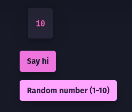

#  Strobe
Turn your functions into whole websites/GUI programs in a matter of seconds! ⚡

## Create a Tkinter Window

```py
from strobe.gui import GUI

gui = GUI(title='Welcome to Strobe!') # Create a new window

@gui.button() # Add a new button
def say_hi(): # Keep in mind the @-Decorators are always ABOVE a function or method, and can't be used "alone"
    gui.set_title('Hi!') # Change the window's title

@gui.button(text='Close Program', color='red') # Button options
def close():
    gui.win.destroy() # You can freely configure the tkinter window and use its methods as you wish!

gui.start() # Runs the GUI program/window
# /!\ Any code under gui.start() will run after the window has been CLOSED!
```

## Flask Website


```py
from strobe.web import Web

web = Web(title='Web Demo') # create a Flask application

@web.button(label='Say hi') # add a new button labelled "Say hi"
def say_hi():
    return 'Hello there!' # this message will be displayed when the button is clicked

@web.button(label='Random number (1-10)') # add a new button labelled "Random number (1-10)"
def random_number():
    return random.randint(1, 10) # return a random number from 1 to 10

web.start() # Start the Web server
```

## Disclaimer
The web feature is **not** made to be **secure**! Its main purpose is to be a tool for admins only.
### Make sure to keep the **web feature private**!